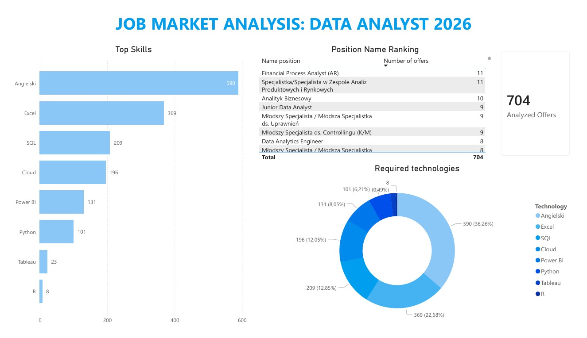

# 📊 Job Market Analysis: Data Analyst (Poland 2026)

### 🎯 Project Objective
The goal of this project was to analyze **real-world requirements** for Junior Data Analyst positions in Poland.

### 🖼️ Final Dashboard

*(Above: Interactive Power BI dashboard visualizing the analysis results)*

### 🔍 Key Findings (Sample Size: N=704 offers)
After analyzing **704 unique job offers** collected in January 2026, the data revealed:

1.  **English (84% of offers):** The absolute barrier to entry.
2.  **Excel (52% of offers):** Remains the dominant tool for business, required **3x more often** than Python for junior roles.
3.  **SQL (30% of offers):** The standard for data extraction.
4.  **Python (14% of offers):** A valuable asset, but less critical for entry-level positions than foundational tools.

---

### 🛠️ Tech Stack & Methodology
This project demonstrates a full **ETL (Extract, Transform, Load)** process built from scratch:

* **Python (Selenium):** Custom web scraper designed to handle pagination and bypass anti-bot protections (Cloudflare) using a remote debugging session.
* **Pandas:** Data cleaning, deduplication, and One-Hot Encoding of skills.
* **Power BI:** Data visualization, DAX measures, and trend analysis.

### 📂 Repository Structure
* `1_link_harvester.py` - Scraper Stage 1: Iterates through search result pages to collect unique job links.
* `2_skill_extractor.py` - Scraper Stage 2: Visits each offer, extracts the description, and identifies keywords.
* `final_1000_jobs.csv` - The raw dataset generated by the bot.
* `requirements.txt` - List of Python dependencies.

---

### 🚀 How to Run This Project
Since the target website uses advanced anti-bot protection, this scraper connects to an existing Chrome session.

**1. Prerequisites**
Install the required libraries:

pip install -r requirements.txt

**2. Prepare Chrome**
 Close all Chrome windows. Open your terminal (CMD) and launch Chrome with the debugging port enabled:
"C:\Program Files\Google\Chrome\Application\chrome.exe" --remote-debugging-port=9222 --user-data-dir="%USERPROFILE%\Desktop\chrome_projekt_data".
A new Chrome window will appear. Do not close it! The script needs this specific window to operate.
**3. Run the Scrapers**
   
Step 1: Run 1_link_harvester.py to collect job URLs.

Step 2: Run 2_skill_extractor.py to analyze the descriptions and generate the CSV dataset.

👨‍💻 Author
Krzysztof Kulwicki - Aspiring Data Analyst. 
Connect with me on https://www.linkedin.com/in/krzysztof-kulwicki-215a272b2/

